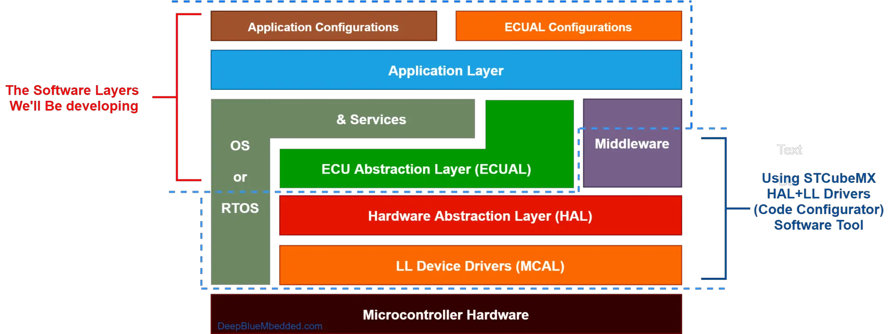
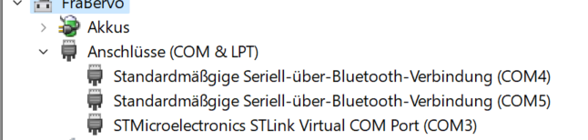

# Setting Up STM32 Ecosystem
Operating System: 
- Windows 11 Home
- Intel Core i5-8250U CPU 1.680GHz 1.80GHz
- RAM: 8 GB 
- ROM: 25 
## Choose of IDE - STM32CUBE IDE
- Reason: It provides so many features to simplify and accelerate the development, debugging, and testing tasks. 
- Link for [download](https://www.st.com/en/development-tools/stm32cubeide.html)

## Firmware Development Level of Abstraction

Focused on layers: Application Layer and middleware (ECU Abstraction layer [ECUAL] drivers)

Benefits of the selected layers: 
- Learn how to develop reusable, configurable firmware drivers for different modules, sensors, and interfaces.
- Have an embedded software stack that can potentially run on any STM32 microcontroller with very little effort, because we will rely on STM's HAL + LL drivers, which have common APIs across STM's entire portfolio of STM32 microcontroller families.

## STM32 CubeMx

Used to: 
+ Set up and configure the low-level hardware and peripherals.
+ Configure the microcontroller's clock tree to determine the different clock speeds for the system, buses and peripherals.

How we work with STM32CubeMx: 

[Link to download](https://www.st.com/en/development-tools/stm32cubemx.html)

## ST-Link V2 Driver

To do: 
- Make sure that the driver for the ST-Link v2 programmer/debugger is correctly installed and that it's assigned a virtual COM port.  --> After installing the ST-Link driver, connect the STM32 board and go to the device manager and check in the Connections / Port section.

The STM32 Board is connected on COM Port 3. 

**Note:**\
The driver must be installed prior to connecting the device, in order to have a successful enumeration.

[Link for download](https://www.st.com/en/development-tools/stsw-link009.html)